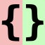

<p align="center">
  
  <h1 align="center">jsondiffpatch</h1>
  <p align="center">
    <a href="https://jsondiffpatch.com">jsondiffpatch.com</a>
    <br/>
    Diff & patch JavaScript objects
  </p>
</p>

<!--- badges -->
<p align="center">
  <a href="https://github.com/benjamine/jsondiffpatch/actions?query=branch%3Amaster"></a>
  <a href="https://twitter.com/beneidel" rel="nofollow"></a>
  <a href="https://opensource.org/licenses/MIT" rel="nofollow"></a>
  <a href="https://www.npmjs.com/package/jsondiffpatch" rel="nofollow"></a>
  <a href="https://github.com/benjamine/jsondiffpatch" rel="nofollow"></a>
</p>

---

## **[Live Demo](https://jsondiffpatch.com)**

- min+gzipped ~ 16KB
- browser and server (ESM-only)
- deep diff, use delta to patch
- smart array diffing using [LCS](http://en.wikipedia.org/wiki/Longest_common_subsequence_problem), **_IMPORTANT NOTE:_** to match objects inside an array you must provide an `objectHash` function (this is how objects are matched, otherwise a dumb match by position is used). For more details, check [Array diff documentation](docs/arrays.md)
- (optionally) text diffing of long strings powered by [google-diff-match-patch](http://code.google.com/p/google-diff-match-patch/) (diff at character level)
- reverse a delta, unpatch (eg. revert object to its original state using a delta)
- multiple output formats:
  - pure JSON, low footprint [delta format](docs/deltas.md)
  - <span style="background-color: #bbffbb; color: black;">visual</span> <span style="background-color: #ffbbbb; color:black; text-decoration: line-through">diff</span> (html), see [demo](https://jsondiffpatch.com)
  - annotated JSON (html), to help explain the delta format with annotations
  - JSON Patch ([RFC 6902](https://datatracker.ietf.org/doc/html/rfc6902)), can generate patches, and also apply them
  - console (colored), try running `./node_modules/.bin/jsondiffpatch left.json right.json`
  - write your own! check [Formatters documentation](docs/formatters.md)
- BONUS: `jsondiffpatch.clone(obj)` (deep clone)

## Supported platforms

- Any browser that [supports ES6](https://caniuse.com/es6)
- Node.js 18, 20+

## Usage

on your terminal:

```sh
npx jsondiffpatch --help
```


or as a library:

```ts
// sample data
const country = {
  name: 'Argentina',
  capital: 'Buenos Aires',
  independence: new Date(1816, 6, 9),
};

// clone country, using dateReviver for Date objects
const country2 = JSON.parse(JSON.stringify(country), jsondiffpatch.dateReviver);

// make some changes
country2.name = 'Republica Argentina';
country2.population = 41324992;
delete country2.capital;

const delta = jsondiffpatch.diff(country, country2);

assertSame(delta, {
  name: ['Argentina', 'Republica Argentina'], // old value, new value
  population: ['41324992'], // new value
  capital: ['Buenos Aires', 0, 0], // deleted
});

// patch original
jsondiffpatch.patch(country, delta);

// reverse diff
const reverseDelta = jsondiffpatch.reverse(delta);
// also country2 can be return to original value with: jsondiffpatch.unpatch(country2, delta);

const delta2 = jsondiffpatch.diff(country, country2);
assert(delta2 === undefined);
// undefined => no difference
```

Array diffing:

```ts
// sample data
const country = {
  name: 'Argentina',
  cities: [
    {
      name: 'Buenos Aires',
      population: 13028000,
    },
    {
      name: 'Cordoba',
      population: 1430023,
    },
    {
      name: 'Rosario',
      population: 1136286,
    },
    {
      name: 'Mendoza',
      population: 901126,
    },
    {
      name: 'San Miguel de Tucuman',
      population: 800000,
    },
  ],
};

// clone country
const country2 = JSON.parse(JSON.stringify(country));

// delete Cordoba
country.cities.splice(1, 1);

// add La Plata
country.cities.splice(4, 0, {
  name: 'La Plata',
});

// modify Rosario, and move it
const rosario = country.cities.splice(1, 1)[0];
rosario.population += 1234;
country.cities.push(rosario);

// create a configured instance, match objects by name
const diffpatcher = jsondiffpatch.create({
  objectHash: function (obj) {
    return obj.name;
  },
});

const delta = diffpatcher.diff(country, country2);

assertSame(delta, {
  cities: {
    _t: 'a', // indicates this node is an array (not an object)
    1: [
      // inserted at index 1
      {
        name: 'Cordoba',
        population: 1430023,
      },
    ],
    2: {
      // population modified at index 2 (Rosario)
      population: [1137520, 1136286],
    },
    _3: [
      // removed from index 3
      {
        name: 'La Plata',
      },
      0,
      0,
    ],
    _4: [
      // move from index 4 to index 2
      '',
      2,
      3,
    ],
  },
});
```

For more example cases (nested objects or arrays, long text diffs) check `packages/jsondiffpatch/test/examples/`

If you want to understand deltas, see [delta format documentation](docs/deltas.md)

## Installing

### NPM

This works for node, or in browsers if you already do bundling on your app

```sh
npm install jsondiffpatch
```

```js
import {* as jsondiffpatch} from 'jsondiffpatch';
const jsondiffpatchInstance = jsondiffpatch.create(options);
```

### browser

In a browser, you can load a bundle using a tool like [esm.sh](https://esm.sh) or [Skypack](https://www.skypack.dev).

## Options

```ts
import * as jsondiffpatch from 'jsondiffpatch';

// Only import if you want text diffs using diff-match-patch
import { diff_match_patch } from '@dmsnell/diff-match-patch';

const jsondiffpatchInstance = jsondiffpatch.create({
  // used to match objects when diffing arrays, by default only === operator is used
  objectHash: function (obj) {
    // this function is used only to when objects are not equal by ref
    return obj._id || obj.id;
  },
  arrays: {
    // default true, detect items moved inside the array (otherwise they will be registered as remove+add)
    detectMove: true,
    // default false, the value of items moved is not included in deltas
    includeValueOnMove: false,
  },
  textDiff: {
    // If using text diffs, it's required to pass in the diff-match-patch library in through this proprty.
    // Alternatively, you can import jsondiffpatch using `jsondiffpatch/with-text-diffs` to avoid having to pass in diff-match-patch through the options.
    diffMatchPatch: diff_match_patch,
    // default 60, minimum string length (left and right sides) to use text diff algorithm: google-diff-match-patch
    minLength: 60,
  },
  propertyFilter: function (name, context) {
    /*
       this optional function can be specified to ignore object properties (eg. volatile data)
        name: property name, present in either context.left or context.right objects
        context: the diff context (has context.left and context.right objects)
      */
    return name.slice(0, 1) !== '$';
  },
  cloneDiffValues: false /* default false. if true, values in the obtained delta will be cloned
      (using jsondiffpatch.clone by default), to ensure delta keeps no references to left or right objects. this becomes useful if you're diffing and patching the same objects multiple times without serializing deltas.
      instead of true, a function can be specified here to provide a custom clone(value).
      */
  omitRemovedValues: false /* if you don't need to unpatch (reverse deltas),
      "old"/"left" values (removed or replaced) are not included in the delta.
      you can set this to true to get more compact deltas.
      */,
});
```

## Visual Diff

```html
<!doctype html>
<html>
  <head>
    <link rel="stylesheet" href="./style.css" type="text/css" />
    <link
      rel="stylesheet"
      href="https://esm.sh/jsondiffpatch@0.6.0/lib/formatters/styles/html.css"
      type="text/css"
    />
    <link
      rel="stylesheet"
      href="https://esm.sh/jsondiffpatch@0.6.0/lib/formatters/styles/annotated.css"
      type="text/css"
    />
  </head>
  <body>
    <div id="visual"></div>
    <hr />
    <div id="annotated"></div>
    <script type="module">
      import * as jsondiffpatch from 'https://esm.sh/jsondiffpatch@0.6.0';
      import * as annotatedFormatter from 'https://esm.sh/jsondiffpatch@0.6.0/formatters/annotated';
      import * as htmlFormatter from 'https://esm.sh/jsondiffpatch@0.6.0/formatters/html';

      const left = { a: 3, b: 4 };
      const right = { a: 5, c: 9 };
      const delta = jsondiffpatch.diff(left, right);

      // beautiful html diff
      document.getElementById('visual').innerHTML = htmlFormatter.format(
        delta,
        left,
      );

      // self-explained json
      document.getElementById('annotated').innerHTML =
        annotatedFormatter.format(delta, left);
    </script>
  </body>
</html>
```

To see formatters in action check the [Live Demo](https://jsondiffpatch.com).

For more details check [Formatters documentation](docs/formatters.md)

## Plugins

`diff()`, `patch()` and `reverse()` functions are implemented using Pipes & Filters pattern, making it extremely customizable by adding or replacing filters on a pipe.

Check [Plugins documentation](docs/plugins.md) for details.

## Related Projects

- [jsondiffpatch.net (C#)
  ](https://github.com/wbish/jsondiffpatch.net)
- [SystemTextJson.JsonDiffPatch
  (C#)](https://github.com/weichch/system-text-json-jsondiffpatch)
- [Go JSON Diff (and Patch)
  ](https://github.com/yudai/gojsondiff)
- [json-diff-patch (python)](https://github.com/apack1001/json-diff-patch)
- [jsondiffpatch-react](https://github.com/bluepeter/jsondiffpatch-react), also check docs for [usage in react](/docs/react.md)

## All contributors ✨

<a href="https://github.com/benjamine/jsondiffpatch/graphs/contributors">
  <p align="center">
    
  </p>
</a>
