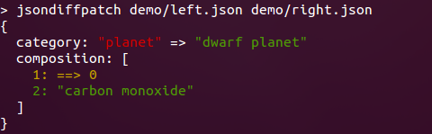

Formatters
==========

Some formatters are included that let you convert a JSON delta into other formats, you can see some of these used in the [Live Demo](http://benjamine.github.com/jsondiffpatch/demo/index.html)

Html
----

add ```build/formatters.js``` and ```src/formatters/html.css``` to your page, and:

``` javascript
  var delta = jsondiffpatch.diff(left, right);
  // left is optional, if specified unchanged values will be visible too
  document.getElementBy('the-diff').innerHTML = jsondiffpatch.formatters.html.format(delta, left);


  // Also you can dinamically show/hide unchanged values
  jsondiffpatch.formatters.html.showUnchanged();
  jsondiffpatch.formatters.html.hideUnchanged();
  // these will also adjust array move arrows (SVG), which is useful if something alters the html layout
```

Html can be generated sever-side the same way, just remember to include (or embed) ```/src/formatters/html.css``` when rendering.

Annotated JSON
----

This will render the original JSON delta in html, with annotations aside explaining the meaning of each part. This attempts to make the JSON delta format self-explained.

add ```build/formatters.js``` and ```src/formatters/annotated.css``` to your page, and:

``` javascript
  var delta = jsondiffpatch.diff(left, right);
  document.getElementBy('the-diff').innerHTML = jsondiffpatch.formatters.annotated.format(delta);
```

Html can be generated sever-side the same way, just remember to include (or embed) ```/src/formatters/annotated.css``` when rendering.

Console
-------

Node.js colored output (thanks to [chalk](https://github.com/sindresorhus/chalk)!).
It's used by the CLI:



but you can use it programmatically too:

``` javascript
var delta = jsondiffpatch.diff(left, right);
var output = jsondiffpatch.formatters.console.format(delta);
console.log(delta);

// or simply
jsondiffpatch.console.log(delta);
```

Create one
----------

Of course, first step to create a formatters is understanding the [delta format](deltas.md).

To simplify the creation of new formatters, you can base yours in the ```BaseFormatter``` included. All the builtin formatters do, check the [formatters](../src/formatters) folder to get started.
